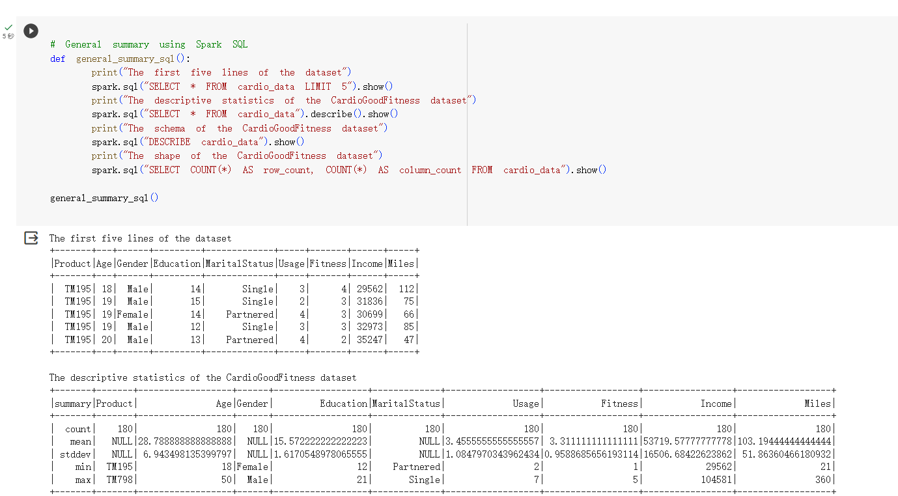
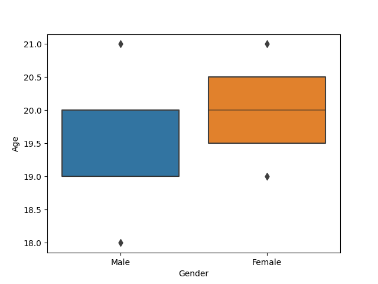
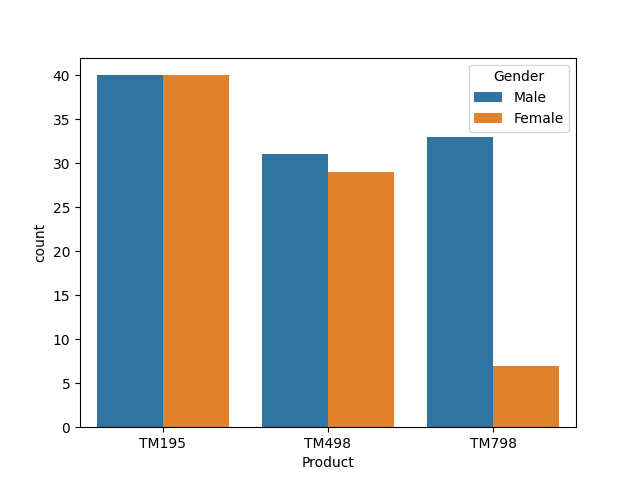
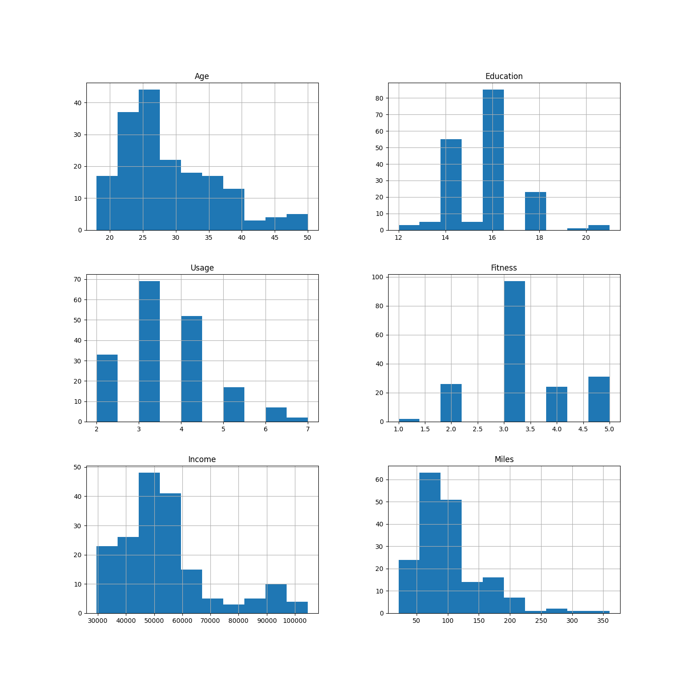
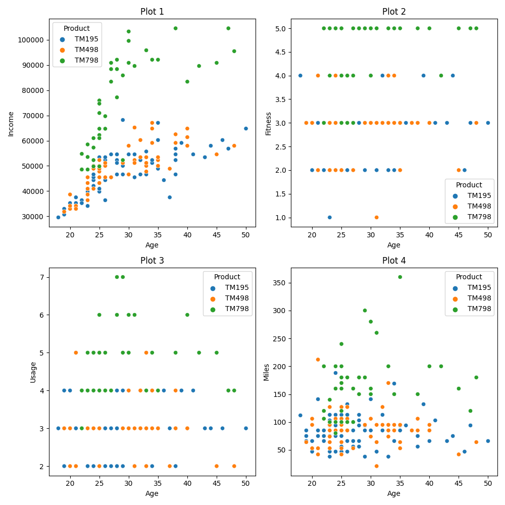

# Week 9: Cloud-Hosted Notebook Data Manipulation
# Purpose
This problem is from Kaggle. The market research team at AdRight is assigned the task to identify the profile of the typical customer for each treadmill product offered by CardioGood Fitness. The market research team decides to investigate whether there are differences across the product lines with respect to customer characteristics. The team decides to collect data on individuals who purchased a treadmill at a CardioGoodFitness retail store during the prior three months. The data are stored in the CardioGoodFitness.csv file. The team identifies the following customer variables to study: product purchased, TM195, TM498, or TM798; gender; age, in years;education, in years; relationship status, single or partnered; annual household income ($); average number of times the customer plans to use the treadmill each week; average number of miles the customer expects to walk/run each week; and self-rated fitness on an 1-to-5 scale, where 1 is poor shape and 5 is excellent shape. Perform descriptive analytics to create a customer profile for each CardioGood Fitness treadmill product line.

# Requirements
- Set up a cloud-hosted Jupyter Notebook (e.g., Google Colab)
- Perform data manipulation tasks on a sample dataset

# Output

## Descriptive statistics

## Visualization
### Box plot

### Histogram plot

### Scatter plot

# Conclusion
From the above plots and forms, we can conclude(infer) that TM798 is the more expensive and better one.
